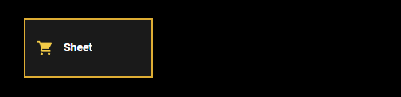
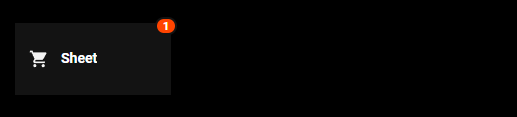

# 📝 Sheet Card for Home Assistant

**Sheet Card** brings a reusable **edge-sheet / drawer pattern** to Home Assistant dashboards.
It allows you to open a slide-in panel from any screen edge containing any Lovelace card.

Unlike typical popup solutions, `sheet-card` behaves like a **true UI component**. It can be triggered from buttons, navbars, scripts, or other frontend events without relying on navigation hacks.

The card is designed to be:

* highly configurable
* visually customizable
* safe to embed anywhere in Lovelace layouts
* compatible with modern dashboard UI patterns

---

# ✨ Features

* Slide-in **sheet panel from any edge** (left, right, top, bottom)
* **Launcher card** or **icon button**
* **Frontend event triggering** (`sheet_id`)
* **Badge support with JS templates**
* **Blurred / gradient background scrim**
* **Drag-to-close with velocity detection**
* **Handle-only drag mode**
* **Fully styleable launcher**
* **Portal overlay rendering** (prevents clipping issues in nested layouts)
* **Works inside other custom cards**

---

# 📦 Installation

## HACS (recommended)

Search for:

```
Sheet Card
```

Install and reload resources.

---

## Manual

Copy the file:

```
sheet-card.js
```

to:

```
/config/www/
```

Then add it to your Lovelace resources:

```yaml
resources:
  - url: /local/sheet-card.js
    type: module
```

---

# Basic Example

```yaml
type: custom:sheet-card
sheet_id: shopping
icon: mdi:cart
edge: right
width: 420

card:
  type: entities
  entities:
    - entity: light.living_room
    - entity: switch.coffee_machine
```

This creates a launcher card that opens a sheet from the **right side**.

<p align="center">
  
</p>

---

# Triggering the Sheet

## From another card or navbar

```yaml
tap_action:
  action: fire-dom-event
  sheet_card:
    action: open
    id: shopping
```

Supported actions:

```
open
close
toggle
```

---

# ⚙️ Configuration

## Main Options

| Option     | Type          | Default   | Description                                                     |
| ---------- | ------------- | --------- | --------------------------------------------------------------- |
| `sheet_id` | string        | none      | Unique identifier used to open/close the sheet from other cards |
| `icon`     | string        | none      | Launcher icon                                                   |
| `title`    | string        | `"Sheet"` | Header title                                                    |
| `hint`     | string        | empty     | Small subtitle text                                             |
| `edge`     | string        | `right`   | Sheet opening edge (`left`, `right`, `top`, `bottom`)           |
| `width`    | number/string | `420`     | Width for left/right sheets                                     |
| `height`   | string        | `60vh`    | Height for top/bottom sheets                                    |
| `radius`   | number        | `20`      | Panel corner radius                                             |
| `inset`    | number        | `8`       | Distance from screen edge                                       |
| `card`     | Lovelace card | required  | Content inside the sheet                                        |

---

# Launcher Configuration

| Option                  | Type    | Default   | Description               |
| ----------------------- | ------- | --------- | ------------------------- |
| `launcher_mode`         | string  | `default` | `default` or `icon`       |
| `launcher_size`         | number  | `45`      | Icon button size          |
| `launcher_radius`       | number  | `10`      | Icon button corner radius |
| `launcher_show_chevron` | boolean | `true`    | Show arrow icon           |
| `launcher_class`        | string  | none      | Custom CSS class          |
| `launcher_style`        | CSS     | none      | Custom CSS styling        |

### 🧩 Example

```yaml
launcher_style: |
  background: rgba(30,30,30,0.85);
  border: 2px solid #DEAD34;
  box-shadow: none;

  .launcher-icon {
    color: #ffd54a;
    --mdc-icon-size: 22px;
  }
```

<p align="center">
  
</p>

---

# Badge

The badge supports **JavaScript templates**.

| Option           | Type        | Description              |
| ---------------- | ----------- | ------------------------ |
| `badge_template` | JS template | Calculates badge value   |
| `badge_style`    | CSS         | Additional badge styling |

Example:

```yaml
badge_template: |
  [[[ 
    const count = states['todo.shopping_list'].state;
    return Number(count) > 0 ? count : "";
  ]]]

badge_style: |
  top: -6px;
  right: -6px;
```

<p align="center">
  
</p>

---

# Scrim (Background Overlay)

| Option          | Type       | Default | Description             |
| --------------- | ---------- | ------- | ----------------------- |
| `scrim`         | boolean    | true    | Show background overlay |
| `scrim_color`   | rgb string | `0,0,0` | Overlay color           |
| `scrim_opacity` | number     | `0.35`  | Overlay opacity         |
| `scrim_blur`    | number     | `0`     | Background blur         |
| `scrim_style`   | CSS        | none    | Custom overlay styling  |

Example blur:

```yaml
scrim_blur: 8
```

Example gradient:

```yaml
scrim_style: |
  background: linear-gradient(
    rgba(0,0,0,0.4),
    rgba(0,0,0,0.8)
  );
```

---

# Panel Configuration

| Option                  | Type | Default          | Description             |
| ----------------------- | ---- | ---------------- | ----------------------- |
| `panel_background`      | CSS  | theme background | Custom panel background |
| `panel_backdrop_filter` | CSS  | none             | Blur / filter           |
| `panel_style`           | CSS  | none             | Extra panel styling     |

Example gradient panel:

```yaml
panel_background: |
  linear-gradient(
    rgba(30,30,30,0.9),
    rgba(10,10,10,0.95)
  )
```

Example glass effect:

```yaml
panel_backdrop_filter: blur(12px)
```

---

# Header & Controls

| Option        | Type    | Default |
| ------------- | ------- | ------- |
| `show_header` | boolean | true    |
| `show_close`  | boolean | true    |
| `show_handle` | boolean | true    |

Example minimal sheet:

```yaml
show_header: false
show_close: false
```

---

# Drag Behaviour

| Option             | Type    | Default |
| ------------------ | ------- | ------- |
| `drag_to_close`    | boolean | true    |
| `drag_handle_only` | boolean | false   |
| `drag_threshold`   | number  | 0.28    |
| `drag_velocity`    | number  | 900     |

Example:

```yaml
drag_handle_only: true
```

---

# Advanced Usage

## Hidden Launcher

You can hide the launcher and control the sheet entirely from other UI elements.

```yaml
launcher_style: |
  display: none;
```

---

## Floating Icon Button

```yaml
launcher_mode: icon
launcher_size: 46
launcher_radius: 12
```

---

## Fully Transparent Launcher

```yaml
launcher_style: |
  background: transparent;
  border: none;
  box-shadow: none;
```

---

# Example: Advanced Sheet

```yaml
type: custom:sheet-card
sheet_id: shopping

launcher_mode: icon
launcher_size: 50

edge: right
width: 420
radius: 0
inset: 2

scrim: true
scrim_blur: 6
scrim_opacity: 0.35

panel_backdrop_filter: blur(12px)

badge_template: |
  [[[ return states['todo.shopping_list'].state ]]]

card:
  type: entities
  entities:
    - entity: todo.shopping_list
```

---

# Tips

### Works well with

* navbar-card
* mushroom cards
* button-card
* custom dashboards

### Common patterns

* **navigation drawer**
* **todo list panel**
* **music controls**
* **device quick controls**

---

# Troubleshooting

### Sheet does not open

Check that `sheet_id` matches the trigger.

```
sheet_id: shopping
```

and

```
id: shopping
```

must be identical.

---

# Contributing

Pull requests and improvements are welcome.

Ideas for future versions:

* multi-sheet stacking
* snap positions
* swipe gestures
* adaptive mobile layout

---

# License

MIT License
